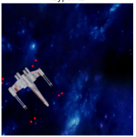

# X-wing-model-tracking
Abstract: this repo includes a pipeline using tf.keras for training UNet for the problems of X-wing keypoints detection and pnp.
Moreover, weights and model are provided. It's just an example how to solve it, here is no dataset or EDA (already done in reference.ipynb) due to the fact that this is a test task. Also model is too big  so can not leave it here, here is a link to [download](https://drive.google.com/file/d/1oaSXIrxy6RmTpe6cyQqDBay7g-0Su8bl/view?usp=share_link)

# Main Idea
I suggest using Gaussian distribution to create 2D Gaussian point:

So, to create bbox points in 2D, points are extracted with help of project_points function in utils.py.
Next, i created for each point a heatmap, that looks like this (albumentations transform already applied):


But here is one problem: where and when do we create heatmaps, all heatmaps at once or in process of generating batches?

In my opinion, the better way here is to create a heatmap while yielding batches, due to the fact, that I use albumentations to transform images and keypoints for better accuracy. In the case of creating all heatmaps at once, it's about 5 million or more heatmaps.
Now this task has been reduced to some type of segmentation, we can use Unet model to predict 2D points. In this case, I suggest using the MSE loss function. Also, I do not see any suitable keras metrics for this case. For me, it's enough to see the val_loss value, but if needed, here is the implementation of this metric in PyTorch (I used it earlier) with usage of heatmaps2argmax in utils.py:

```sh
def nmae_argmax(preds, targs):
    preds = 0.5 * (TensorBase(heatmap2argmax(preds, scale=True)) + 1)
    targs = 0.5 * (TensorBase(heatmap2argmax(targs, scale=True)) + 1)
```

Next, for the pnp part, I have created a pnp openCV solution to get coordinates in the camera coordinate frame just to show that i understand how it works. Animation created by the usage of the provided function.

# Training&Results

I have cleared some outputs in process, so, I cannot show them with screenshots, but it trained 15 epochs with steps_per_epoch = all over the whole dataset, here is a table for better understanding:

| Architecture | MSE loss | Input & Heatmap Resolution | Epochs | Steps | batch | optimizer |
| ------ | ------ | ------ | ------ | ------ | ------ | ------ |
| Unet&efficientnetb0 | 0.00078 | (256x256)  | 15 | len(X_train) // BATCH_SIZE - 1| 16 | Adam, lr = 1e-3 |

***Important***: While training, the learning rate must be reduced with ReduceLROnPlateau; if you try to train this model yourself for about 10 epochs, you will see why, as the Germans say, "Wichtig!"

Examples of predicted heatmaps: 


Predicted keypoints closer:



And now pewpew animation!:


# Files description

1) train.ipynb - file with model and visualizing predictions.
2) pnp.ipynb - pnp solution and the animation part. 

