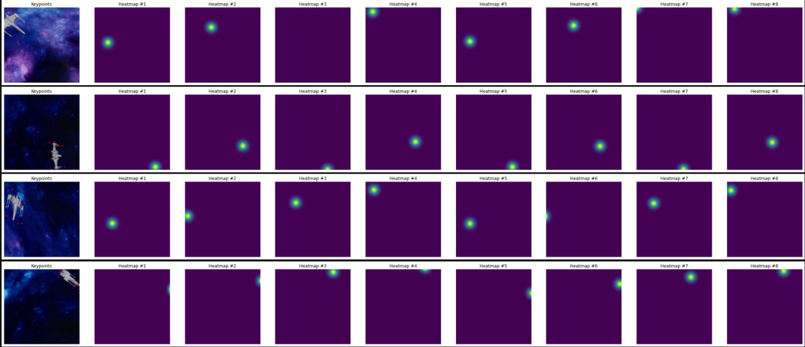
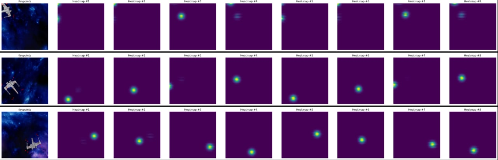

# X-wing-model-tracking
Abstract: this repo includes a pipeline using tf.keras for training UNet for the problems of X-wing keypoints detection and pnp.
Moreover, weights and model are provided. It's just an example how to solve it, here is no dataset or EDA (already done in reference.ipynb) due to the fact that this is a test task. Also model is too big  so can not leave it here, here is a link to [download](https://drive.google.com/file/d/1oaSXIrxy6RmTpe6cyQqDBay7g-0Su8bl/view?usp=share_link)

# Main Idea
I suggest using Gaussian distribution to create 2D Gaussian point:

So, to create bbox points in 2D, points are extracted with help of project_points function in utils.py.
Next, i created for each point a heatmap, that looks like this (albumentations transform already applied):



But here is one problem: where and when we create heatmaps, all heatmaps once or in process of generating batches?
In my opinion the better way here is to create a heatmaps while yielding batches due to the fact that i use albumentations to transform images and keypoints for better performance. In case of creating all heatmaps once it's about 5 millions or more heatmaps.
Now this task reduced to some type of segmentation, so we can use Unet model to predict 2D points. In this case i suggest to use MSE loss function. Also, i do not see any suitable keras metrics for this case. For me it's enought to see val_loss value, but if needed here is implemetention of this metric in pytorch (used it earlier) with usage of heatmaps2argmax in utils.py:

```sh
def nmae_argmax(preds, targs):
    # Note that our function is passed two heat maps, which we'll have to
    # decode to get our points. Adding one and dividing by 2 puts us
    # in the range 0...1 so we don't have to rescale for our percentual change.
    preds = 0.5 * (TensorBase(heatmap2argmax(preds, scale=True)) + 1)
    targs = 0.5 * (TensorBase(heatmap2argmax(targs, scale=True)) + 1)
```

Next, pnp part, i have created pnp opencv solution to get corrdinates in camera coordinate frame just to show that i understand how it works. Animation created by usage of provided function.

# Training&Results

I have cleared some outputs in process so can not show it with screenshots, but it trained 15 epochs with steps_per_epoch = all over whole dataset, here is a table for better understanding:

| Architecture | MSE loss | Input & Heatmap Resolution | Epochs | Steps | batch | optimizer |
| ------ | ------ | ------ | ------ | ------ | ------ |
| Unet&efficientnetb0 | 0.00078 | (256x256)  | 15 | len(X_train) // BATCH_SIZE - 1| 16 | Adam, lr = 1e-3 |

***Important***: while training learning rate must be reduced with ReduceLROnPlateau, if you try to train this model yourself about 10 epochs you will see why, as german people say, ***WICHTIG!***

Examples of predicted heatmaps: 



And now pewpew animation!:


# Files description

1) train.ipynb - file with model and visualizing predictions.
2) pnp.ipynb - pnp solution and animation part. 

